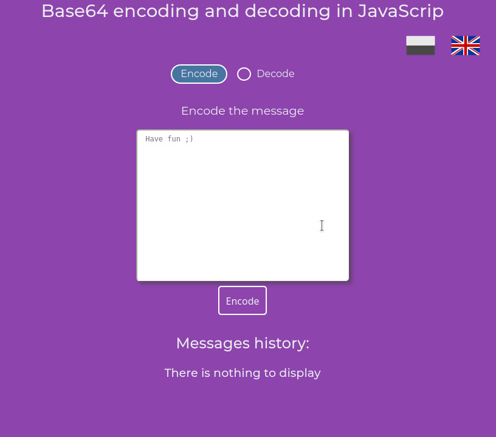
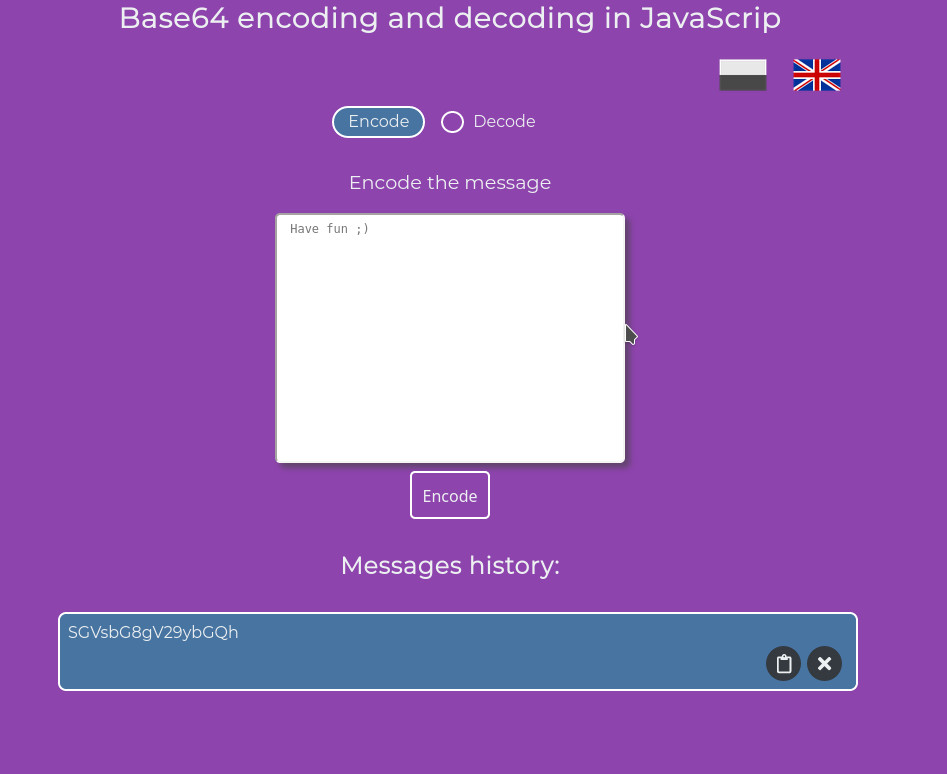
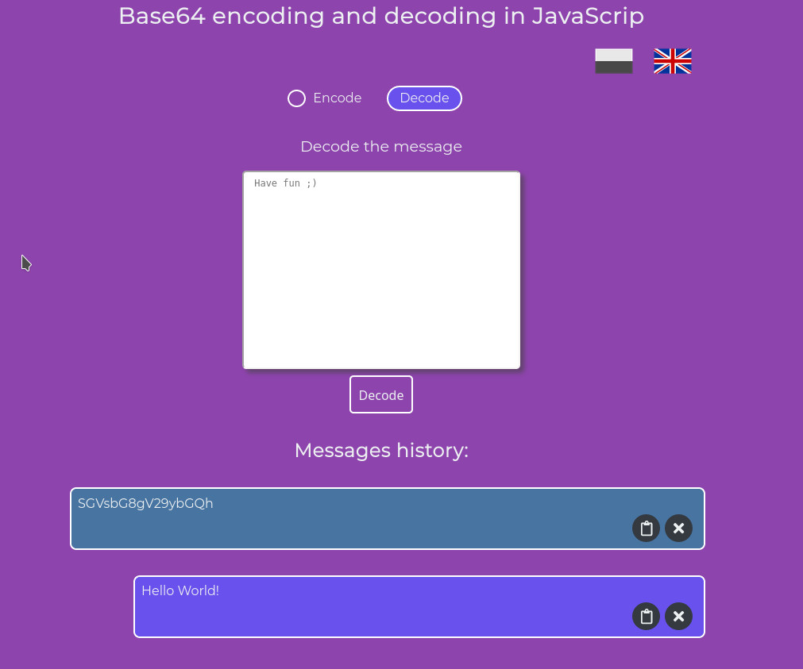

# Base64 encoding and decoding in JavaScript

With this application we can encode and decode a text that we wanna send to some one by via internet or text message by phone and use this app for decode text.

### Technologies used in project

- JavaScript
- Webpack
- Webpack-dev-server
- Sass

### Installation

To install all dependencies just run in console:

```
$ npm install
```

### Start webpack server

To run application:

```
$ npm start
```

## How it works...

This application is easy to use. Put a text that u wanna encode to textarea and click on the button.



### Encode text

After the message is encoded we will see a text at the bottom in "Messages history". We can copy this by clicking a button or delete it. Message is also located in session storage so we won't lose it after refreshing a page.



### Decode text

If we wanna decode ouer message just change option by clicking "Decode" and paste a text in textarea then you will see in your "Messages history" a decoded text.


